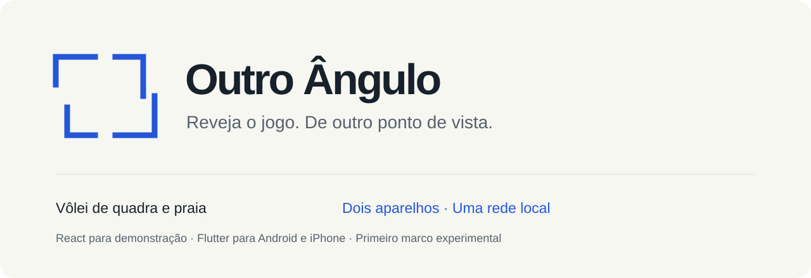
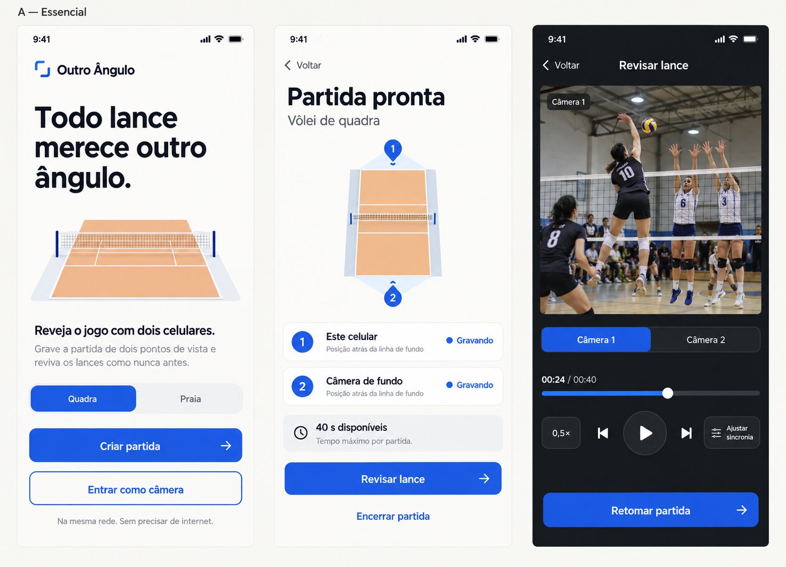
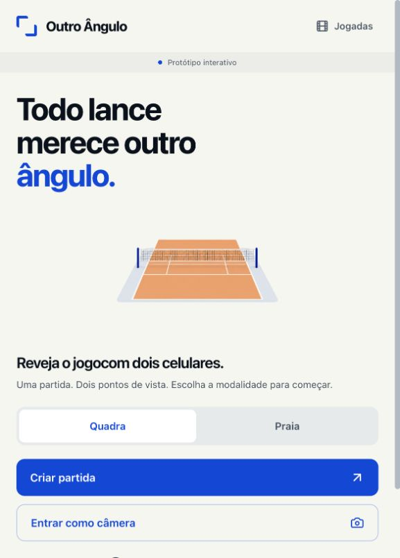
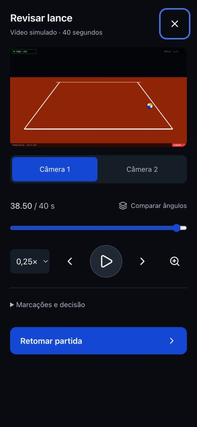
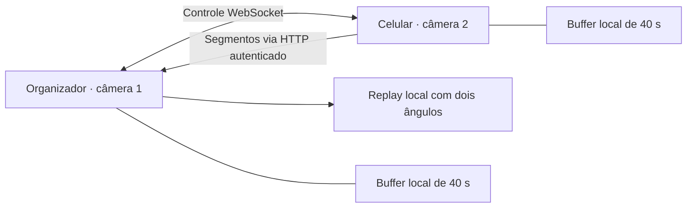

<p align="center">
  
</p>

<p align="center">
  <a href="#-comece-pelo-web">Experimentar o web</a> ·
  <a href="#-android-e-iphone">Executar no celular</a> ·
  <a href="docs/VALIDATION.md">Validação e limites</a> ·
  <a href="DESIGN.md">Design system</a>
</p>

<p align="center">
  
  
  
</p>

# 🏐 Outro Ângulo

**Dois pontos de vista para rever o mesmo lance.** Outro Ângulo é o nome de trabalho do projeto anteriormente chamado **VAR-ÃO**: uma experiência de replay para jogadores amadores de vôlei de quadra e praia.

O repositório reúne uma **demonstração web em React** e um **primeiro aplicativo Flutter para Android e iPhone**. A proposta nativa é usar dois celulares na mesma rede local, sem internet durante a partida. Ambos capturam vídeo; o organizador pausa a captura para revisar a janela recente e depois retoma o jogo.

> **Estado do marco:** o código nativo foi implementado, mas a sessão completa entre Android e iPhone ainda requer validação física. A gravação segmentada pode deixar lacunas; não há garantia de captura contínua nem precisão de arbitragem. Consulte o [registro de validação](docs/VALIDATION.md).

---

## 📑 Navegue pela documentação

| Guia | O que você encontra |
| :--- | :--- |
| [Produto](PRODUCT.md) | Público, objetivos e limites do primeiro marco |
| [Design system](DESIGN.md) | Identidade A — Essencial, tokens e padrões de interface |
| [Frontend](src/README.md) | Organização React, telas e estado demonstrativo |
| [Componentes](src/components/README.md) | Quadra, replay, webcam, galeria e diálogos |
| [Tipos](src/types/README.md) | Modelos TypeScript e limites dos dados simulados |
| [Utilitários](src/utils/README.md) | Renderização ilustrativa do lance em Canvas |
| [Aplicativo mobile](apps/mobile/README.md) | Ambiente, instalação, captura e reprodução |
| [Protocolo local](docs/PROTOCOL.md) | Convite, controle, relógios e transferência |
| [Validação](docs/VALIDATION.md) | Verificações executadas e roteiro em aparelhos reais |
| [Roadmap](ROADMAP.md) | Trabalho entregue e próximos passos |

## ✨ Uma interface mais simples

A direção **A — Essencial** foi escolhida para substituir a estética tática escura e verde: fundo branco quente, texto grafite, ações em azul e replay escuro. O mapa da quadra ajuda a organizar os ângulos; os controles priorizam linguagem simples e leitura no celular.

### Proposta visual aprovada



*Imagem conceitual gerada para aprovar a direção visual. Não é captura do aplicativo; textos e detalhes podem diferir da implementação. Os 40 segundos representam a janela de replay, não a duração máxima de uma partida.*

A [alternativa B](docs/design/option-b.png) fica preservada como histórico da decisão.

### Interface implementada · capturas reais do web

<p align="center">
  
  
</p>

*Capturas do React em execução, em 28/09/2026. O vídeo mostrado é a animação demonstrativa. Não são capturas do Flutter nem evidência de pareamento entre celulares.*

## 🎯 O que funciona em cada plataforma

| Capacidade | Web React | Flutter Android / iPhone |
| :--- | :--- | :--- |
| Início, modalidade e organização de câmeras | Demonstração interativa | Fluxo nativo implementado |
| Câmera do aparelho | Prévia local da webcam | Captura local sem áudio |
| Replay | Animação ilustrativa em Canvas | Reprodução de arquivos capturados e recebidos |
| Dois aparelhos | Simulação; não pareia celulares | Convite QR/manual e comunicação local implementados |
| Janela recente | Simulada | Buffer segmentado de aproximadamente 40 s |
| Ângulos, reprodução lenta e zoom | Controles demonstrativos | Implementados, com ajuste temporal manual |
| Galeria | Metadados e exportação de resumo `.txt` | Fora deste marco |
| Planos e assinatura | Interface demonstrativa, sem cobrança | Fora deste marco |

**Implementado não significa validado em aparelhos reais.** Os testes automatizados e as pendências estão separados em [VALIDATION.md](docs/VALIDATION.md).

## 🚀 Comece pelo web

Requer **Node.js 22.12 ou superior**. Use **npm**; o `package-lock.json` é a referência reproduzível de dependências.

```sh
git clone https://github.com/felipeatene/var_ao.git
cd var_ao
# Enquanto o PR não estiver integrado:
git switch codex/outro-angulo
npm ci
npm run dev -- --host 127.0.0.1
```

Abra **http://127.0.0.1:3000**. Nenhuma chave de API é necessária. O `.env.example` documenta apenas configuração opcional; as variáveis antigas de Gemini e URL de aplicação não eram utilizadas e foram removidas.

| Comando | Finalidade |
| :--- | :--- |
| `npm run dev -- --host 127.0.0.1` | Desenvolvimento local na porta 3000 |
| `npm run lint` | Checagem TypeScript (`tsc --noEmit`), não ESLint |
| `npm run build` | Build de produção em `dist/` |
| `npm run preview -- --host 127.0.0.1` | Visualização do build de produção |

### CI, ambiente de teste e deploy automático

O repositório possui workflows em `.github/workflows` para validar e publicar o web automaticamente no GitHub:

- `CI` roda em `push`/`pull_request`/manual com:
  - Web: `npm ci`, `npm run lint`, `npm run build`
  - Mobile: `./scripts/mobile.sh pub get`, `./scripts/mobile.sh analyze`, `./scripts/mobile.sh test --no-pub`
- `CI` também publica o artefato `web-dist` (pasta `dist/`) como ambiente de teste para validação do build gerado em cada execução.
- `Deploy Web` roda no `push` da branch `main` (e manualmente) para publicar `dist/` no GitHub Pages. Ele valida que `dist/index.html` usa os assets compilados em `/var_ao/assets/` (e não `/src/main.tsx`) antes de publicar. Em *Settings → Pages*, a fonte deve ser **GitHub Actions**.
- O build de produção usa `base: '/var_ao/'` (`vite.config.ts`), pois o site é publicado em `https://felipeatene.github.io/var_ao/`; o `npm run dev` continua servindo em `/`.

O antigo `bun.lock` foi substituído pelo lockfile npm. Dependências sem uso foram removidas, incluindo a dependência direta de esbuild que conflitava com o Vite 8.

## 📱 Android e iPhone

Ambiente de referência: **Flutter 3.47.5 / Dart 3.13.4**, Java 17 e ferramentas Android; macOS com Xcode e CocoaPods para iOS. As versões resolvidas dos plugins estão no `apps/mobile/pubspec.lock`.

Instale Flutter e deixe seu executável no `PATH`, ou indique o caminho:

```sh
export FLUTTER_BIN=/caminho/para/flutter/bin/flutter
./scripts/mobile.sh doctor -v
./scripts/mobile.sh pub get
./scripts/mobile.sh analyze
./scripts/mobile.sh test
./scripts/mobile.sh devices
./scripts/mobile.sh run -d ID_DO_APARELHO
```

O wrapper também aceita ferramentas opcionais em `../.tooling/`, fora do repositório. Não é necessário criar essa pasta em outra máquina. Veja [ambiente e solução de problemas](apps/mobile/README.md).

```sh
# Android: APK de depuração
./scripts/mobile.sh build apk --debug

# iOS: aplicativo para simulador
./scripts/mobile.sh build ios --simulator --debug

# iOS: verificar compilação para dispositivo sem assinatura
./scripts/mobile.sh build ios --debug --no-codesign
```

Para instalar em um iPhone real, configure sua equipe de desenvolvimento no Xcode, conecte o aparelho e habilite o modo de desenvolvedor. O build `--no-codesign` **não** é um aplicativo pronto para instalação no iPhone. SDKs, certificados e builds não fazem parte do Git.

## 🎬 Da partida ao replay

1. **Prepare a rede.** Conecte os dois celulares ao mesmo Wi-Fi ou hotspot criado manualmente. A rede deve permitir comunicação entre aparelhos.
2. **Crie a partida.** No organizador, escolha quadra ou praia, toque em **Criar partida** e autorize câmera e rede local.
3. **Adicione o segundo ângulo.** No outro aparelho, use **Entrar como câmera** e leia o QR ou cole o convite.
4. **Confira o enquadramento.** Posicione ambos e inicie a captura pelo organizador. Mantenha os aplicativos abertos.
5. **Revise o lance.** A ação pausa a captura e transfere os segmentos. Uma janela ainda incompleta aparece como tal.
6. **Compare os ângulos.** Alterne a câmera, reduza a velocidade, amplie a imagem e ajuste o alinhamento temporal quando necessário.
7. **Retome a partida.** A captura recomeça com um novo buffer. Ao encerrar a sessão, os arquivos temporários são removidos.

## 📡 Arquitetura local



Flutter cuida da interface e do estado; plugins integram câmera e reprodução nativas. O organizador mantém a sessão, e cada aparelho grava seus próprios arquivos. O convite contém endereço local e credencial temporária. A diferença entre relógios é estimada por amostras de ida e volta; a reprodução permite correção manual.

Os segmentos pedidos são preservados durante a transferência, que suporta retomada por intervalo e verificação SHA-256. O protocolo usa HTTP/WebSocket autenticados **sem TLS**: utilize uma rede de confiança. Leia os detalhes em [PROTOCOL.md](docs/PROTOCOL.md).

## 🧪 Limites e validação

- Dois aparelhos; configuração solicitada de 720p/30 fps, sem áudio. O formato efetivo depende do hardware.
- Segmentos de aproximadamente cinco segundos podem apresentar lacunas ao parar/iniciar a câmera. O player sinaliza intervalos sem vídeo.
- A estimativa de relógio não mede atraso do sensor. Não há garantia de sincronia por quadro nem de ±0,4 ms.
- Ao perder conexão ou enviar o aplicativo ao segundo plano, a captura é interrompida. Pode ser necessário iniciar uma nova sessão.
- Não há criação automática de hotspot, captura com tela bloqueada, galeria nativa, cobrança ou publicação em lojas.
- A webcam web não grava nem transmite para outros aparelhos. Dados de bateria, FPS e lances do demonstrador não são telemetria real.

Consulte [testes e pendências](docs/VALIDATION.md) antes de utilizar o app em uma partida. Este marco experimental serve para avaliação e evolução do produto.

## 🗺️ Evolução do projeto

O [roadmap](ROADMAP.md) prioriza validação física entre plataformas, continuidade da captura e robustez da reconexão. Galeria nativa, monetização e distribuição em lojas exigem etapas próprias; as telas demonstrativas não representam serviços comerciais ativos.

## 🤝 Contribuição

Ao abrir uma issue, informe plataforma, modelo do aparelho, versão do sistema, tipo de rede e passos para reproduzir. Não publique convites de sessão, vídeos de terceiros ou credenciais. Em alterações, rode as verificações relevantes e atualize a documentação quando o comportamento mudar.

Este repositório não declara uma licença de distribuição nesta entrega. Não presuma uma licença a partir da disponibilidade pública do código.

## Planos e limites demonstrativos

O CTA “Assinar Plano Pro — R$ 9,00/mês” ativa apenas a simulação: não há compra ou cobrança. Free permite duas câmeras e três salvamentos por semana (segunda a domingo no horário local). A cota é persistida neste navegador; exemplos não contam e excluir jogadas não devolve a cota. Salvamentos Pro também são contabilizados. Falha de armazenamento mantém a contagem em memória com aviso.

Tentar exceder os limites, escolher 1080p ou remover a marca abre a oferta com o motivo, sem executar a ação. Fechar mantém Free; ativar Pro permite tentar novamente. A galeria exporta um resumo `.txt`; qualidade e marca são opções simuladas. Estas regras locais não constituem segurança comercial nem sincronizam entre dispositivos.

Testes: `npm test`, `npm run lint` e `npm run build`.
